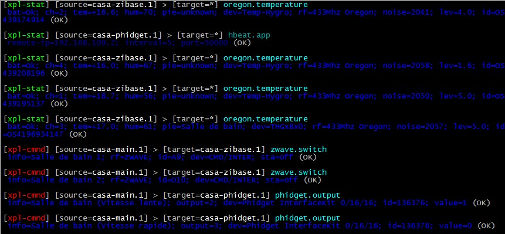

# xplmon.py #

## What is it ? ##

**xplmon.py** is a simple XPL monitor written in Python. It connects to a XPL hub, and displays all the XPL frames passing through.

## What is XPL ? ##

**XPL** is a protocol used in home automation. It allows several software modules to communicate with each other via a "software bus". Communication is based on UDP. A **XPL software hub** must be present on the network. Any other XPL software connects to the HUB, then it can receive and send XPL data.

More information about XPL can be found [here](http://xplproject.org.uk/).

## How to use it ? ##

Run the **xplmon.py** script in a Linux shell. It will connect to a XPL hub, then it will display continuously all the XPL frames, in a readable form, with colors. 

Type CTRL+C to abort.

## Requirements ##

Requirements :

- Python 2.7+
- Linux (may work under Windows, but untested)
- Twisted (Python asynchronous library)
- xpllib.py (My XPL library)

## Author ##

This software is (c) Toussaint OTTAVI, bc-109 Soft 

Web : [http://www.bc-109.com](http://www.bc-109.com)

Mail : [t.ottavi@bc-109.com](mailto:t.ottavi@bc-109.com)

## License ##

This is free software: you can redistribute it and/or modify it under the terms of the GNU General Public License as published by the Free Software Foundation, either version 3 of the License, or (at your option) any later version.

This program is distributed in the hope that it will be useful, but WITHOUT ANY WARRANTY; without even the implied warranty of MERCHANTABILITY or FITNESS FOR A PARTICULAR PURPOSE.  See the GNU General Public License for more details.

You should have received a copy of the GNU General Public License along with this program.  If not, see <http://www.gnu.org/licenses/>.

